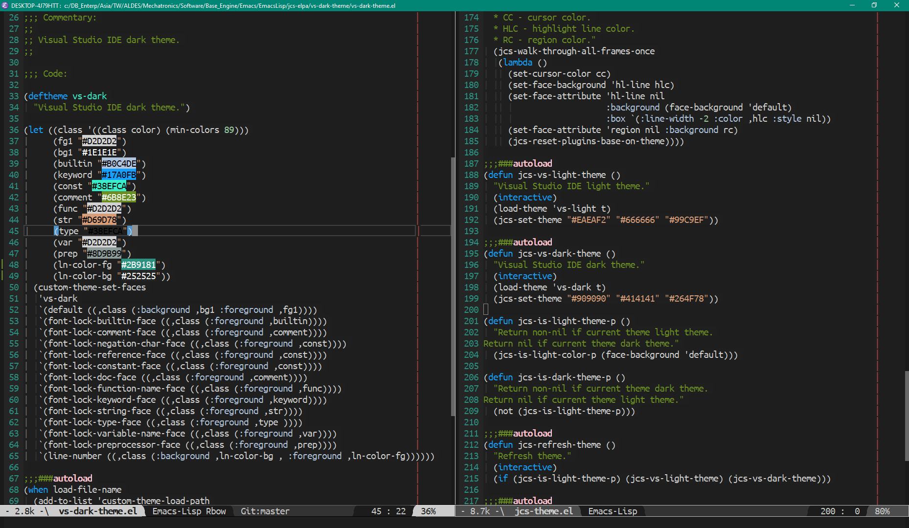

# vs-dark-theme
> Visual Studio IDE dark theme.

  

## Contribution

If you would like to contribute to this project, you may either 
clone and make pull requests to this repository. Or you can 
clone the project and establish your own branch of this tool. 
Any methods are welcome!
